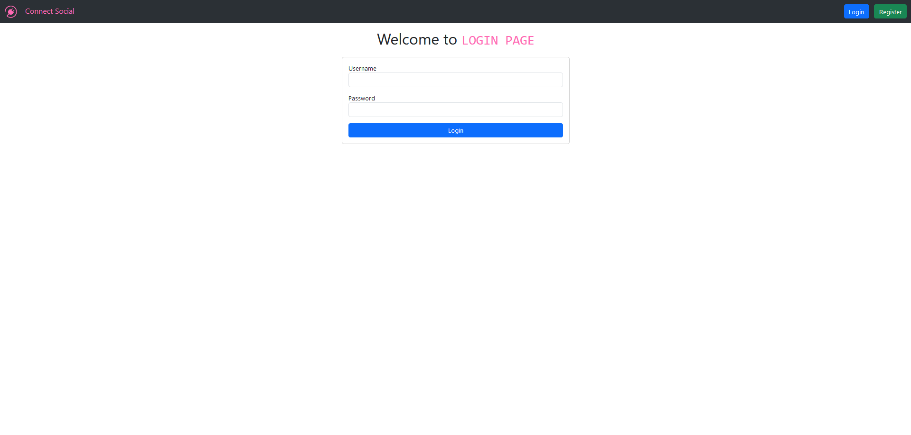
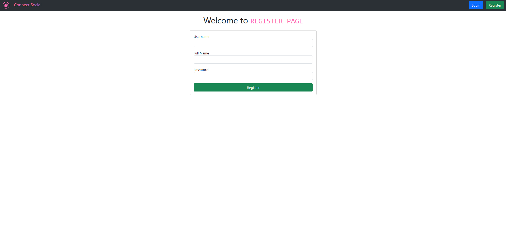
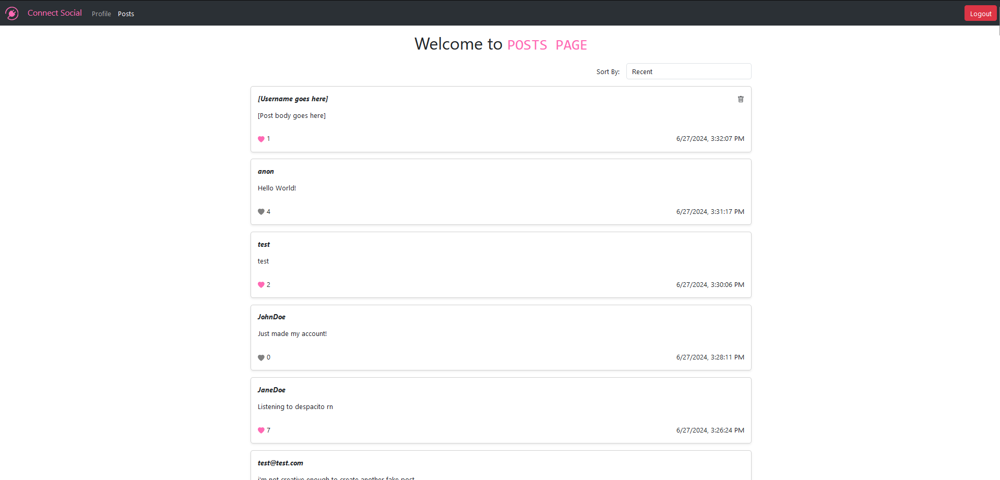
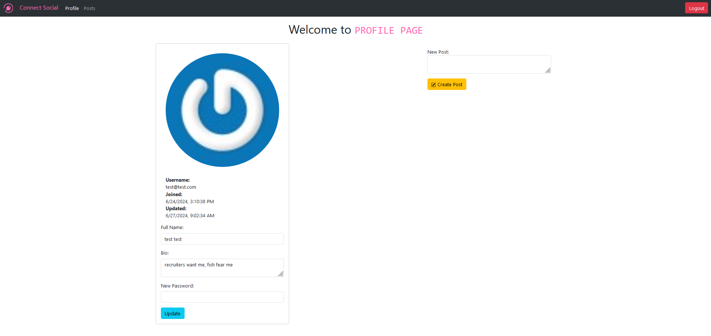
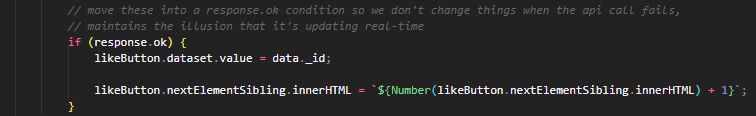

# Enjoy the Microblog Project and the MicroblogLite API!

Don't forget to read the [*MicroblogLite* API docs](http://microbloglite.us-east-2.elasticbeanstalk.com/docs) and experiment with the API in *Postman!*

Practice and experimentation provide experience, and experience provides confidence.

## About
This is a small project utilizing HTML, CSS, and JavaScript to create a funcitoning social media website. I utilized api calls, Gravatar, Bootstrap classes and icons, and the CryptoJS library to achieve the end result.

## Login Page

The login page is a simple form that takes in a username and passwrord that, on submit, will either log a user in or fail if invalid cridentials are given.

## Register Page

The register page is a simple form that takes in a username, full name, and password that, on submit, will either create a new account or notify the user that an account with that username already exists.

## Posts Page

The posts page displays the 100 most recent posts and a dropdown to sort them (by recent, author, or likes). For each post, the page will display the author's username, the post's body, a like icon with number of likes, timestamp of post's creation, and a delete icon. A note about the delete icon, is that it only appears on posts where the author is the user currently signed in.

## Profile Page

The profile page display the information of a currenly signed in user, including a profile picture (utilizing Gravatar to do so), and two forms. One form will allow a user to update their full name, bio, and password. The other form will allow the user to create a new post, given a post body. As a note, I know post creation is better suited for the posts page but this is what was requested.

## A cool piece of JavaScript

I like the code above because, while not technically challenging or impressive, I think it brings attention to the user experience. In this case, we change the number of likes displayed for the user ONLY when we get receive a successful response in order to maintain the illusion that the page is updating live.